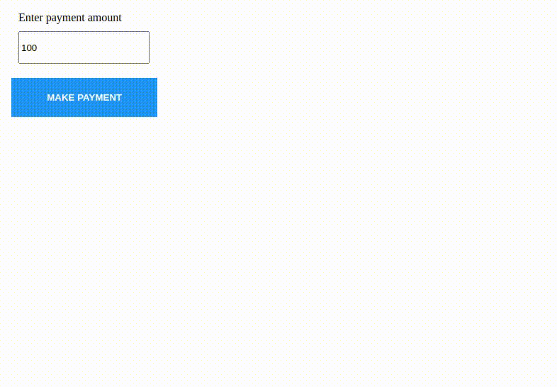

# Web SDK Demo

This project demonstrates how to effectively use window.postMessage() and iframe to expose your already existing website as a web sdk to partners/clients and establish two way communication between them.

We'll be taking a payments website as an example and building a wrapper project that will call a SDK which we would expose APIs like onSuccess and onCallback to the partner.

## Instructions to start the project

```bash
npm run dev
```

## Screenshots


